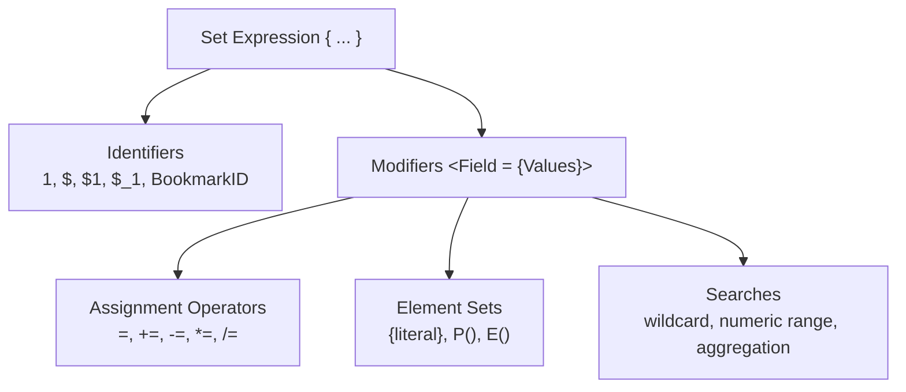

# Qlik Sense Expressions Reference (Frontend)

Use this guide to write and optimise frontend expressions, aggregations, Set Analysis, and layout calculations in Qlik Sense sheets. All functions here run in chart expressions — never in the load script.

## Companion references

| Reference | Use when |
|-----------|----------|
| [Scripting Knowledgebase](scripting_knowledgebase.md) | Writing or reviewing backend load scripts, LOAD/SELECT/JOIN patterns |
| [Functions Reference](functions_reference.md) | Looking up any Qlik function signature, parameters, or examples |
| [Advanced Patterns](advanced_patterns.md) | Implementing complex Set Analysis, alternate states, or advanced aggregation |
| [Debugging Guide](debugging_guide.md) | Diagnosing expression errors, zero vs null results, or Set Analysis scope issues |
| [Visualisation Guide](visualization_guide.md) | Choosing chart types, applying DAR layout, or styling dashboards |

## Table of Contents

1. [Set Analysis Syntax](#1-set-analysis-syntax)
2. [Set Modifiers](#2-set-modifiers)
3. [Common Set Analysis Patterns](#3-common-set-analysis-patterns)
4. [Aggregation Functions Reference](#4-aggregation-functions-reference)
5. [The Aggr() Function](#5-the-aggr-function)
6. [TOTAL Qualifier](#6-total-qualifier)
7. [Date & Time Functions (Frontend)](#7-date--time-functions-frontend)
8. [String Functions (Frontend)](#8-string-functions-frontend)
9. [Conditional & Logical Functions](#9-conditional--logical-functions)
10. [Color Functions](#10-color-functions)
11. [Layout & Navigation Functions](#11-layout--navigation-functions)
12. [Range Functions](#12-range-functions)
13. [Ranking & Sorting](#13-ranking--sorting)
14. [Variables in Expressions](#14-variables-in-expressions)
15. [Alternate States](#15-alternate-states)
16. [Master Items](#16-master-items)
17. [Complex Expression Patterns](#17-complex-expression-patterns)

---

## 1. Set Analysis Syntax

Set Analysis defines a specific subset of data for a chart aggregation, overriding the active user selections.

### Base Structure
```qlik
AggregationFunction( { SetExpression } FieldName )
Sum( { <Year = {2026}> } SalesAmount )
```



### Set Identifiers
| Identifier | Meaning | Example |
| :--- | :--- | :--- |
| `1` | Entire dataset — ignores all selections | `Sum({1} Sales)` |
| `$` | Current selection state (default) | `Sum({$} Sales)` |
| `$1` | One step forward in selection history | `Sum({$1} Sales)` |
| `$_1` | One step backward in selection history | `Sum({$_1} Sales)` |
| `BookmarkID` | A named or ID-referenced bookmark state | `Sum({BM01} Sales)` |

### Set Operators (combining identifiers)
```qlik
Sum({$ + BM01} Sales)           // Union: current selections PLUS bookmark
Sum({1 - $} Sales)              // Exclusion: total database MINUS current selection
Sum({$ * BM01} Sales)           // Intersection: in current selection AND bookmark
Sum({$ / BM01} Sales)           // Symmetric difference
```

---

## 2. Set Modifiers

Modifiers narrow or expand selections on specific fields within the set expression.

### Assignment Operators
```qlik
Sum({<Year = {2026}>} Sales)            // Override Year field to 2026 only
Sum({<Year = >} Sales)                  // Clear all Year selections
Sum({<Year += {2026}>} Sales)           // Add 2026 to current Year selections
Sum({<Year -= {2020}>} Sales)           // Remove 2020 from current Year selections
Sum({<Year *= {2025, 2026}>} Sales)     // Intersect — only keep 2025 or 2026
```

### Wildcard Search in Modifiers
```qlik
Sum({<Product = {"Glass*"}>} Sales)     // Products starting with "Glass"
Sum({<Product = {"*Premium*"}>} Sales)  // Products containing "Premium"
Sum({<Region = {"?A"}>} Sales)          // Two-char Region ending in "A" (ZA, SA, etc.)
```

### Numeric Range Search
```qlik
Sum({<SalesAmount = {">0<1000"}>} Sales)                // Between 0 and 1000
Sum({<OrderDate = {">=2026-01-01<=2026-06-30"}>} Sales) // Date range
Sum({<Age = {">=18<=65"}>} Customers)                   // Age between 18 and 65
```

### Aggregation Search (Value Search)
Selects field values based on a calculated aggregation threshold:
```qlik
// Customers whose total sales exceed 100,000
Sum({<Customer = {"=Sum(Sales) > 100000"}>} Sales)

// Products with more than 5 orders
Count({<Product = {"=Count(OrderID) > 5"}>} OrderID)
```

### Dollar-Sign Expansion in Modifiers
Use `$(=expression)` to evaluate a dynamic value before the Set Analysis runs:
```qlik
// Max year in the data (not the selected year)
Sum({<Year = {"$(=Max(Year))"}>} Sales)

// Prior year
Sum({<Year = {"$(=Max(Year)-1)"}>} Sales)

// Rolling date range from variables
Sum({<OrderDate = {">=$(=vStartDate)<=$(=vEndDate)"}>} Sales)

// Year-to-date (1 Jan of the selected year to today)
Sum({<OrderDate = {">=$(=Date(YearStart(Max(OrderDate)), 'YYYY-MM-DD'))<=$(=Date(Today(), 'YYYY-MM-DD'))"}>} Sales)
```

### Element Functions: P() and E()
```qlik
// Customers who have EVER purchased "Shoes" (regardless of current Product selection)
Sum({<Customer = P({<Product = {'Shoes'}>} Customer)>} Sales)

// Customers who have NEVER purchased "Shoes"
Sum({<Customer = E({<Product = {'Shoes'}>} Customer)>} Sales)

// Multi-condition P() filter
Sum({<Customer = P({<Product = {'Shoes'}, Year = {2025}>} Customer)>} Sales)
```

---

## 3. Common Set Analysis Patterns

### Year-over-Year Comparison
```qlik
// Current selected year
Sum({<Year = {$(=Max(Year))}>} Sales)           as [Current Year Sales]

// Prior year (always one year before max selected)
Sum({<Year = {$(=Max(Year)-1)}>} Sales)         as [Prior Year Sales]

// YoY variance %
(Sum({<Year = {$(=Max(Year))}>} Sales) /
 Sum({<Year = {$(=Max(Year)-1)}>} Sales)) - 1  as [YoY Growth %]
```

### Year-to-Date (YTD) vs Prior Year-to-Date
```qlik
// YTD: From start of selected year to the max date in that year
Sum({<
    OrderDate = {">=$(=Date(YearStart(Max({1} OrderDate)), 'YYYY-MM-DD'))
                 <=$(=Date(Max({1} OrderDate), 'YYYY-MM-DD'))"},
    Year = {$(=Max(Year))}
>} Sales)

// PYTD: Same period last year
Sum({<
    OrderDate = {">=$(=Date(AddYears(YearStart(Max({1} OrderDate)), -1), 'YYYY-MM-DD'))
                 <=$(=Date(AddYears(Max({1} OrderDate), -1), 'YYYY-MM-DD'))"}
>} Sales)
```

### Moving Annual Total (MAT / Rolling 12 Months)
```qlik
Sum({<
    OrderDate = {">=$(=Date(AddYears(Max({1} OrderDate), -1)+1, 'YYYY-MM-DD'))
                 <=$(=Date(Max({1} OrderDate), 'YYYY-MM-DD'))"}
>} Sales)
```

### Ignore Specific Field Selections
```qlik
// Total sales regardless of Region selection (all other selections respected)
Sum({<Region = >} Sales)

// Total sales ignoring ALL selections for a KPI card showing grand total
Sum({1} Sales)
```

### Alternate States in Set Analysis
```qlik
// Use the "State2" alternate state for comparison
Sum({[State2]<Year = {2025}>} Sales)
```

---

## 4. Aggregation Functions Reference

### Basic Aggregations
```qlik
Sum(SalesAmount)                            // Sum of all non-null values
Count(OrderID)                              // Count of non-null values
Count(DISTINCT CustomerID)                  // Count of distinct values
Avg(SalesAmount)                            // Arithmetic mean
Min(OrderDate)                              // Minimum value
Max(OrderDate)                              // Maximum value
Median(SalesAmount)                         // 50th percentile
Mode(Category)                              // Most frequent value
```

### Conditional Aggregations
```qlik
Sum(If(Status = 'Active', SalesAmount, 0))           // Sum with condition
Count(If(Country = 'ZA', OrderID))                   // Count with condition
Avg(If(Margin > 0, Margin))                          // Average of positive margins only
```

### String Aggregations
```qlik
Concat(DISTINCT City, ', ')                          // "Cape Town, Johannesburg, Durban"
Concat({<Status={'Active'}>} CustomerName, Chr(10))  // Newline-separated list
MaxString(ProductName)                               // Last alphabetically
MinString(ProductName)                               // First alphabetically
```

### Statistical Aggregations
```qlik
Stdev(SalesAmount)                          // Population standard deviation
Skew(SalesAmount)                           // Skewness of distribution
Kurt(SalesAmount)                           // Kurtosis of distribution
Fractile(SalesAmount, 0.75)                 // 75th percentile
Fractile(SalesAmount, 0.25)                 // 25th percentile (Q1)
```

### First/Last Value Functions
```qlik
FirstSortedValue(CustomerName, OrderDate)   // Customer name for earliest OrderDate
LastSortedValue(ProductName, -SalesAmount)  // Product name for highest SalesAmount
Only(Country)                               // Returns the value only if unique; else NULL
```

---

## 5. The Aggr() Function

Creates a virtual temporary table of aggregated values grouped by dimensions, evaluated per row of the outer aggregation.

### Syntax
```qlik
OuterAggregation( Aggr( InnerAggregation(Field), Dimension1 [, Dimension2] ) )
```

### Common Patterns
```qlik
// Average sales per transaction per customer
Avg(Aggr(Sum(SalesAmount), CustomerID, OrderID))

// Maximum single-order value per customer
Max(Aggr(Sum(SalesAmount), CustomerID, OrderID))

// Count of customers with more than 5 orders
Count({<CustomerID = {"=Count(OrderID) > 5"}>} CustomerID)
// Alternative using Aggr:
Sum(Aggr(If(Count(OrderID) > 5, 1, 0), CustomerID))

// Rank a metric within a group (using Aggr with Rank)
Rank(Aggr(Sum(SalesAmount), CustomerID))
```

> **Performance warning:** `Aggr()` calculates a virtual table in memory per chart row. Avoid using it with high-cardinality dimensions (> 10,000 distinct values). Pre-calculate in the reload script instead.

### Aggr with TOTAL qualifier
```qlik
// Share of wallet: each customer's sales as % of total
Sum(SalesAmount) / Sum(TOTAL SalesAmount)

// Share within a group dimension (e.g., Region)
Sum(SalesAmount) / Sum(TOTAL <Region> SalesAmount)
```

---

## 6. TOTAL Qualifier

Forces an aggregation to ignore one or more chart dimensions.

```qlik
// Percentage of total (ignores all dimensions)
Sum(SalesAmount) / Sum(TOTAL SalesAmount)

// Percentage within Region only (ignores Product dimension, keeps Region)
Sum(SalesAmount) / Sum(TOTAL <Region> SalesAmount)

// Running total across a table (using RowNo trick)
RangeSum(Above(Sum(SalesAmount), 0, RowNo()))
```

---

## 7. Date & Time Functions (Frontend)

### Current Date References
```qlik
Today()                             // Current date (no time)
Now()                               // Current date and time
Now(1)                              // Actual current time (not cached per calc cycle)
```

### Date Extraction
```qlik
Year(OrderDate)                     // 2026
Month(OrderDate)                    // 6
Day(OrderDate)                      // 18
Quarter(OrderDate)                  // 2
Week(OrderDate)                     // ISO week number
Weekday(OrderDate)                  // 0=Mon, 6=Sun
YearToDate(OrderDate)               // 1 if in current YTD, 0 otherwise
YearToDate(OrderDate, -1)           // 1 if in prior year-to-date
```

### Date Boundaries
```qlik
MonthStart(OrderDate)               // First day of the month
MonthEnd(OrderDate)                 // Last day of the month
QuarterStart(OrderDate)             // First day of the quarter
YearStart(OrderDate)                // First day of the year
WeekStart(OrderDate)                // Monday of the week (default)
```

### Period-over-Period using AddMonths / AddYears
```qlik
Sum({<OrderDate = {">=$(=Date(AddYears(Min(OrderDate),-1),'YYYY-MM-DD'))
                   <=$(=Date(AddYears(Max(OrderDate),-1),'YYYY-MM-DD'))"}>} Sales)
```

### Age Calculation
```qlik
Floor((Today() - BirthDate) / 365.25)  // Approximate age in years
```

---

## 8. String Functions (Frontend)

```qlik
Left(FieldName, 3)                  // First 3 characters
Right(FieldName, 4)                 // Last 4 characters
Mid(FieldName, 2, 5)               // 5 chars starting at position 2
Len(FieldName)                     // Character count
Upper(FieldName)                   // UPPERCASE
Lower(FieldName)                   // lowercase
Proper(FieldName)                  // Title Case
Trim(FieldName)                    // Remove leading/trailing spaces
Replace(FieldName, 'old', 'new')   // String replacement
SubField(FieldName, ',', 1)        // First token of comma-delimited string
Index(FieldName, '-')              // Position of first '-'
WildMatch(FieldName, 'SA-*')       // 1 if matches wildcard pattern, else 0
Concat(FieldName, ', ')            // Aggregate: join all values
```

---

## 9. Conditional & Logical Functions

### If / ElseIf Chain
```qlik
If(Condition1, Result1,
   If(Condition2, Result2,
      If(Condition3, Result3, DefaultResult)))
```

### Pick / Match (Cleaner Alternative to Nested If)
```qlik
// Match returns the position (1-based) of the first matching value
Pick(Match(Status, 'Active', 'Pending', 'Closed'), 
     'Green', 'Amber', 'Red')           // RAG status

// Switch pattern using Match
Match(Country, 'ZA', 'South Africa',
               'US', 'United States',
               'UK', 'United Kingdom')
```

### Null Handling
```qlik
IsNull(FieldName)                   // Returns 1 if NULL
Null()                              // Explicit NULL
If(IsNull(Value), 0, Value)        // Replace NULL with 0
Alt(Value, Fallback1, Fallback2)   // First non-NULL value (like COALESCE)
```

### Division Guard
```qlik
// Safe division (avoid divide-by-zero errors)
If(Denominator <> 0, Numerator / Denominator, Null())
// Or use:
Div(Numerator, Denominator)        // Returns NULL instead of error
```

---

## 10. Color Functions

### Direct Color Assignment
```qlik
RGB(255, 0, 0)                     // Red
ARGB(200, 0, 128, 0)               // Semi-transparent green
HSL(0.333, 1, 0.5)                 // Green in HSL space (hue 0-1)
```

### Conditional RAG Coloring
```qlik
// Background color expression in chart properties
If(KPI >= Target,      RGB(0, 176, 80),       // Green
   If(KPI >= Target * 0.9, RGB(255, 192, 0),  // Amber
      RGB(255, 0, 0)))                         // Red
```

### Color Blending
```qlik
ColorMix1(Value/MaxValue, RGB(255, 0, 0), RGB(0, 176, 80))
// Gradient from red (0%) to green (100%)

ColorMix2(Value/MaxValue, RGB(255, 0, 0), RGB(255, 255, 255), RGB(0, 176, 80))
// Red → White → Green gradient through zero
```

### Persistent Colour Mapping (using field values)
```qlik
// In the colour expression of a bar chart:
Pick(Match(Region, 'ZA', 'US', 'UK', 'AU'),
     RGB(0, 70, 127),    // ZA - dark blue
     RGB(178, 34, 34),   // US - red
     RGB(0, 128, 0),     // UK - green
     RGB(255, 165, 0))   // AU - orange
```

---

## 11. Layout & Navigation Functions

### Row / Column Navigation
```qlik
RowNo([TOTAL])                      // Row number in current chart context
NoOfRows([TOTAL])                   // Total rows in chart
ColumnNo([TOTAL])                   // Column number in pivot
NoOfColumns([TOTAL])                // Total columns in pivot
```

### Pivot Table Dimension Level
```qlik
Dimensionality()                    // Number of expanded dimensions on the row
SecondaryDimensionality()           // Horizontal dimension count (pivots)

// Example: Apply different background to totals vs detail rows
If(Dimensionality() = 0, RGB(210, 210, 210),  // Total row
   If(Dimensionality() = 1, RGB(230, 230, 230), // Subtotal
      White()))                                  // Detail
```

### Inter-Row Navigation
```qlik
Above(Sum(Sales))                   // Same expression from row above
Below(Sum(Sales))                   // Same expression from row below
Before(Sum(Sales))                  // Pivot: same expression from column before
After(Sum(Sales))                   // Pivot: same expression from column after

// Month-over-month variance
Sum(Sales) - Above(Sum(Sales))

// Rolling 3-month average
RangeAvg(Above(Sum(Sales), 0, 3))

// Rolling 12-month sum (trailing year)
RangeSum(Above(Sum(Sales), 0, 12))
```

### Selection State Functions
```qlik
GetSelectedCount(FieldName)                  // Number of selected values
GetSelectedCount(FieldName, True)            // Include excluded values in count
GetCurrentSelections('; ', '=', ', ')        // Text of all current selections
GetFieldSelections(FieldName)                // Text of selections for one field
GetObjectDimension(N)                        // Dimension N of current chart (0-based)
GetObjectMeasure(N)                          // Measure N label of current chart
```

---

## 12. Range Functions

Range functions operate across multiple arguments in a single expression row (not across chart rows like `Above()`).

```qlik
RangeSum(v1, v2, v3)                // Sum (NULLs treated as 0)
RangeAvg(v1, v2, v3)                // Average (ignores NULLs)
RangeMax(v1, v2, v3)                // Maximum
RangeMin(v1, v2, v3)                // Minimum
RangeCount(v1, v2, v3)              // Count of non-NULL values
RangeOnly(v1, v2, v3)               // Returns value only if all are identical
RangeMode(v1, v2, v3)               // Most frequent value

// Useful combined with Above() for true rolling calculations:
RangeSum(Above(Sum(Sales), 0, 3))   // 3-period rolling sum (current + 2 prior)
RangeAvg(Above(Sum(Sales), 0, 12))  // 12-period rolling average
```

---

## 13. Ranking & Sorting

```qlik
Rank(Sum(Sales))                        // Rank (1 = highest) in current dimension
Rank(Sum(Sales), 4)                     // Rank mode 4: fractile ranking
Rank(TOTAL Sum(Sales))                  // Rank ignoring dimensions (overall rank)

// Top N filter expression (use in dimension calculated condition):
Rank(Sum(Sales)) <= 10                  // Show only Top 10

// Dynamic ranking variable
Rank(Sum(Sales)) <= $(vTopN)
```

---

## 14. Variables in Expressions

Variables are set in the load script or via input boxes, and referenced in expressions with `$(variableName)`.

```qlik
// Script (define variable)
SET vTargetMargin = 0.35;
LET vCurrentYear = Year(Today());

// Expression (reference variable)
Sum(Sales) * $(vTargetMargin)           // Static expansion
If(Year = $(vCurrentYear), ...)         // Year comparison
```

### Dollar-Sign Expansion
```qlik
// Variable containing a set expression fragment
SET vCYFilter = <Year = {$(=Max(Year))}>;

// Used in multiple expressions:
Sum({$(vCYFilter)} Sales)
Count({$(vCYFilter)} OrderID)
```

### Input Variable (for user-driven parameters)
Use an Input Box object or a variable set via Button action:
```qlik
// Variable name: vTopN (set via input box)
// Expression using it:
Rank(Sum(Sales)) <= $(vTopN)
```

---

## 15. Alternate States

Alternate States allow independent selection contexts in the same app — useful for comparison analysis.

```qlik
// Define states in: App Settings > Alternate States
// States: "State_A", "State_B"

// Expression referencing a specific state:
Sum({[State_A]} Sales)               // Sales with State_A selections
Sum({[State_B]} Sales)               // Sales with State_B selections

// Variance between states:
Sum({[State_A]} Sales) - Sum({[State_B]} Sales)

// Set modifier combining state and field:
Sum({[State_A]<Year = {2026}>} Sales)
```

---

## 16. Master Items

Master items (master dimensions and master measures) centralise expression logic, ensuring consistency across sheets.

**Best practices:**
- Store all reusable KPIs (Revenue, Margin%, YoY Growth) as master measures with a description.
- Use naming conventions: `[KPI] Revenue - CY` vs `[KPI] Revenue - PY`.
- Add colour definitions in the master measure for consistent colouring.
- Label master measures with units in the description (e.g., "ZAR, millions").

---

## 17. Complex Expression Patterns

### Margin % with NULL Guard
```qlik
If(Sum(Revenue) <> 0,
   Sum(Revenue - Cost) / Sum(Revenue),
   Null())
```

### Weighted Average
```qlik
Sum(Price * Quantity) / Sum(Quantity)
```

### Contribution to Total %
```qlik
Sum(Sales) / Sum(TOTAL Sales)
```

### Pareto Analysis (Cumulative % of Total)
```qlik
// In a sorted bar chart (descending Sales), cumulative % expression:
RangeSum(Above(Sum(Sales), 0, RowNo(TOTAL))) / Sum(TOTAL Sales)
```

### Flag Active Customers (purchased in last 90 days)
```qlik
If(Max(OrderDate) >= Today() - 90, 'Active', 'Lapsed')
```

### Cohort: New vs Returning Customers
```qlik
// New: first purchase is in the current period
If(Min(TOTAL <CustomerID> OrderDate) >= Min({1} OrderDate)
   AND Min(TOTAL <CustomerID> OrderDate) <= Max({1} OrderDate),
   'New', 'Returning')
```

### String Aggregation with Conditional Filter
```qlik
// Comma-separated list of active customers over 100K
Concat({<Status={'Active'}, SalesAmount={">=100000"}>} DISTINCT CustomerName, ', ')
```

### Displaying "N/A" Instead of 0 or NULL
```qlik
If(IsNull(Sum(Sales)) OR Sum(Sales) = 0, 'N/A', Num(Sum(Sales), '#,##0'))
```

### Number Formatting in Expressions
```qlik
Num(Sum(Sales), '#,##0.00')             // 1,234,567.89
Num(Sum(Sales) / 1000000, '#,##0.0M')  // 1.2M
Money(Sum(Sales), 'R#,##0.00')         // R1,234,567.89 (ZAR)
Num(Pct, '#0.0%')                      // 87.3%
Date(Max(OrderDate), 'DD MMM YYYY')    // 18 Jun 2026
```
