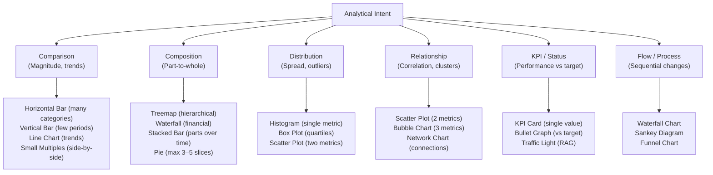

# Qlik Sense Visualisation Selection & Design Guide

Use this guide to select, structure, and style visualisations in Qlik Sense dashboards to ensure clarity, analytical impact, and premium design quality.

## Companion references

| Reference | Use when |
|-----------|----------|
| [Scripting Knowledgebase](scripting_knowledgebase.md) | Writing or reviewing backend load scripts, LOAD/SELECT/JOIN patterns |
| [Expression Knowledgebase](expression_knowledgebase.md) | Writing or debugging frontend chart expressions, Set Analysis, Aggr |
| [Functions Reference](functions_reference.md) | Looking up any Qlik function signature, parameters, or examples |
| [Advanced Patterns](advanced_patterns.md) | Implementing incremental loads, link tables, SCD, hierarchy, or complex modelling |
| [Debugging Guide](debugging_guide.md) | Diagnosing script errors, data model issues, or performance problems |

## Table of Contents

1. [Choosing the Right Visualisation](#1-choosing-the-right-visualisation)
2. [Anti-Patterns: "Please Don't… Use This Instead"](#2-anti-patterns-please-dont-use-this-instead)
3. [KPI Design Patterns](#3-kpi-design-patterns)
4. [Advanced Chart Implementations](#4-advanced-chart-implementations)
5. [Alternate States for Comparison](#5-alternate-states-for-comparison)
6. [Dynamic Dimensions & Measures](#6-dynamic-dimensions--measures)
7. [Developer Mode & Object IDs](#7-developer-mode--object-ids)
8. [Conditional Show / Hide Objects](#8-conditional-show--hide-objects)
9. [Storytelling & Snapshots](#9-storytelling--snapshots)
10. [Styling & Aesthetic Best Practices](#10-styling--aesthetic-best-practices)
11. [Qlik Sense Extensions](#11-qlik-sense-extensions)
12. [Sheet Design Workflow](#12-sheet-design-workflow)

---

## 1. Choosing the Right Visualisation



### Chart Type Matrix

| Intent | Data Context | Recommended Chart | Why / Notes |
| :--- | :--- | :--- | :--- |
| **Comparison** | Many categories (> 6) | Horizontal Bar Chart | Category labels are readable on y-axis without tilting |
| **Comparison** | Few categories, over time | Vertical Bar / Column | Natural representation of time left-to-right |
| **Comparison** | Many periods (> 12) | Line Chart | Shows continuity; bars become unreadable at scale |
| **Comparison** | Multiple sub-series side by side | Small Multiples (Bar Table) | Much cleaner than grouped/interleaved bars |
| **Comparison** | Actual vs. target/budget | Bullet Graph | Encodes actual, target, and benchmark in one compact visual |
| **Comparison** | Two-period change | Slopegraph | Slope angle instantly encodes direction and magnitude |
| **Comparison** | Rank-ordered categories | Sorted Horizontal Bar | Always sort descending unless time-ordered |
| **Composition** | Simple share (few items) | Pie Chart | Limit to 3–5 slices; label directly; never 3D |
| **Composition** | Hierarchical part-to-whole | Treemap | Max 3 levels; use colour for a second metric |
| **Composition** | Sequential financial flow | Waterfall Chart | Shows gains, losses, and net result in narrative |
| **Composition** | Parts over time | Stacked Bar Chart | Show totals + sub-components; avoid too many segments |
| **Composition** | 100% relative comparison | 100% Stacked Bar | Best when absolute totals are irrelevant |
| **Distribution** | Single continuous variable | Histogram | Bin width matters — experiment with 5–20 bins |
| **Distribution** | Quartiles / outliers | Box Plot | Shows median, IQR, and whiskers simultaneously |
| **Relationship** | Two continuous metrics | Scatter Plot | Add a dimension as colour to identify clusters |
| **Relationship** | Three metrics | Bubble Chart | Bubble size = 3rd metric; avoid overlapping bubbles |
| **Relationship** | Three metrics over time | Animated Bubble (Rosling) | Movement through time; use play button |
| **KPI / Status** | Single headline number | KPI Card | Large number, label, comparison delta |
| **KPI / Status** | Contextual performance | Gauge / Dial | Use sparingly — bullet graph is usually superior |
| **Flow** | Conversion or loss | Funnel Chart | Stage-by-stage drop-off is immediately visible |
| **Flow** | Material/financial flows | Sankey Diagram | Flows from source to destination; width = volume |

---

## 2. Anti-Patterns: "Please Don't… Use This Instead"

| Anti-Pattern | Problem | Better Alternative |
| :--- | :--- | :--- |
| Interleaved/grouped vertical bars | Heights are not comparable across groups | Bar Table / Small Multiples grid |
| Dual-axis charts | Two scales confuse readers; lines cross arbitrarily | Split into two adjacent sparkline charts |
| Stacked area charts | Intermediate bands are impossible to read accurately | Line Table with multiple lines |
| Standard legends | Forces eye movement between chart and legend | Direct labels at end of line / on bars |
| Large nested treemaps (> 3 levels) | Looks like a complex bento box — unusable | Simplify to a sorted bar or 2-level treemap |
| 3D pie / donut charts | Perspective distorts area perception | Flat, sorted horizontal bar chart |
| Pie with many slices | Tiny slices are unreadable | Bar chart (horizontal, sorted) |
| Radar / spider charts | Hard to decode; looks impressive but is not informative | Small multiples or bar chart |
| Traffic lights without numbers | Status without context | Show actual value + target + delta beside RAG |
| Giant data tables with 50+ columns | Cognitive overload | Filtered pivots with drill-down |

---

## 3. KPI Design Patterns

### KPI Card Layout
Place KPI cards across the **top row** or **left column** following the F-shaped reading pattern. Each card should show:
1. Headline metric (large font)
2. Comparison value (vs. target, prior period, or budget)
3. Trend indicator (up/down arrow, sparkline, or delta %)

```
┌────────────────────┐  ┌────────────────────┐  ┌────────────────────┐
│  Revenue           │  │  Orders            │  │  Avg Order Value   │
│  R 12.4M     ▲ 8% │  │  4,382       ▲ 3% │  │  R 2,830    ▼ -2% │
│  vs R 11.5M PY     │  │  vs 4,254 PY       │  │  vs R 2,890 PY     │
└────────────────────┘  └────────────────────┘  └────────────────────┘
```

### RAG (Traffic Light) Expression
```qlik
// Background colour expression for a KPI text object
If(Metric >= Target,              RGB(0, 176, 80),     // Green: on target
   If(Metric >= Target * 0.9,     RGB(255, 192, 0),    // Amber: within 10%
      RGB(255, 0, 0)))                                  // Red: below 90%

// Arrow indicator (use in label or text expression)
If(CurrentValue > PriorValue, '▲ ', '▼ ')
& Num(Abs((CurrentValue/PriorValue) - 1), '#0.0%')
```

---

## 4. Advanced Chart Implementations

### Trendline (Linear Regression)
```qlik
// In a line chart with a Date dimension, add a second measure:
// Slope * X + Intercept using LINEST functions
LINEST_M(Sum(Sales), RowNo()) * RowNo() + LINEST_B(Sum(Sales), RowNo())
```

### Bell Curve (Normal Distribution)
```qlik
// Create a continuous numeric dimension (bin), then:
// Y expression using NORMDIST approximation:
Exp(-0.5 * Power((DimValue - Avg(TOTAL {1} Value)) / Stdev(TOTAL {1} Value), 2))
/ (Stdev(TOTAL {1} Value) * Sqrt(2 * 3.14159))
```

### Heatmap / Grid Chart
Use a Pivot Table with:
- Row dimension: Category (e.g., Weekday)
- Column dimension: Sub-category (e.g., Hour of Day)
- Measure background colour: `ColorMix1(Sum(Events)/Max(TOTAL Sum(Events)), RGB(255,255,255), RGB(0,70,127))`

### Gantt Chart (Horizontal Stacked Bar)
```qlik
// Dimension: Project Name
// Measure 1 (invisible base — set to white): Min(StartDate) - Min({1} StartDate)
// Measure 2 (visible bar): Max(EndDate) - Min(StartDate)
// Format axis as date
```

### Butterfly / Tornado Chart
```qlik
// Two horizontal bar charts side by side:
// Left chart: -Sum(Male_Population) [negative values flip to left]
// Right chart: Sum(Female_Population)
// Shared Y-axis: Age Group dimension
```

### Waterfall Chart
Built-in Qlik Sense Waterfall chart — set initial and final bars as "Sum" type; intermediate bars as "Difference" type. Expressions per bar:
```qlik
// Starting Revenue
Sum({<Period = {'Start'}>} Revenue)

// Operating Cost (negative — reduction)
-Sum({<Period = {'Operating'}>} Cost)

// Net Profit (final total)
Sum(Revenue) - Sum(Cost)
```

### Funnel Chart
```qlik
// Dimension: Stage (Awareness, Consideration, Trial, Purchase)
// Measure: Count(DISTINCT CustomerId)
// Sort: by Stage sort order field in data model
```

---

## 5. Alternate States for Comparison

Alternate States allow two independent filter contexts on the same sheet. Use for A/B comparisons, benchmark vs. actuals, or portfolio analysis.

```
App Settings → Alternate States → Add states: "State_A", "State_B"

// Assign objects to a state via: Object properties → Data → State dropdown
// Or: Master visualisation → State override

// Expression referencing State_A explicitly:
Sum({[State_A]} Sales) - Sum({[State_B]} Sales)
```

---

## 6. Dynamic Dimensions & Measures

### Calculated Dimension
Use a dimension expression (not a field) for dynamic grouping:
```qlik
// Group dates into rolling period buckets
If(OrderDate >= Today() - 30, 'Last 30 Days',
   If(OrderDate >= Today() - 90, 'Last 90 Days',
      If(OrderDate >= Today() - 365, 'Last Year', 'Older')))
```

### Cycle Group Dimensions
Assign multiple dimensions to a single button-controlled dimension slot, allowing users to toggle between groupings without navigating away.

### Measure Group (Master Measure Toggle)
Use a variable (from an Input Box or Button) to dynamically switch the measure displayed:
```qlik
// Variable: vSelectedMeasure = 'Revenue' | 'Margin' | 'Units'
Pick(Match($(vSelectedMeasure), 'Revenue', 'Margin', 'Units'),
     Sum(Revenue),
     Sum(Margin),
     Sum(Units))
```

---

## 7. Developer Mode & Object IDs

Activate Developer Mode to expose Object IDs (e.g., `CH176`) required for NPrinting and Qlik Engine API integration.

**Activation:** Append `/options/developer` to the end of the Edit Mode URL in your browser.
```
https://your-server/sense/app/{appId}/sheet/{sheetId}/state/edit/options/developer
```

Right-click any object → "Developer" → Copy Object ID.

---

## 8. Conditional Show / Hide Objects

Use **Show Condition** (in object properties under "Behaviour") to toggle objects based on user interaction:
```qlik
// Show a chart only when a specific dimension is selected
GetSelectedCount(ProductCategory) > 0

// Show alternative text when no selections are made
GetSelectedCount(Region) = 0

// Toggle visibility based on a variable (linked to a button)
$(vShowDetailPanel) = 1
```

---

## 9. Storytelling & Snapshots

Qlik Sense Stories allow you to embed static snapshots of sheet objects into slide-style presentations.

**Best practices:**
- Annotate snapshots with callout shapes and text boxes to highlight key insights.
- Use a consistent slide master template (set background colour/logo in Story settings).
- Combine embedded snapshots with live sheets using "Continue story from sheet" links.
- Avoid showing more than 3 key insights per slide.

---

## 10. Styling & Aesthetic Best Practices

### Colour Palettes

| Use Case | Recommendation |
| :--- | :--- |
| Categorical (distinct groups) | Use 5–7 distinguishable colours; map persistently to field values |
| Sequential (low → high) | Light-to-dark single hue (e.g., light blue to dark navy) |
| Diverging (negative → positive) | Red → White → Green; or Red → White → Blue |
| Status / RAG | Red `RGB(255,0,0)`, Amber `RGB(255,192,0)`, Green `RGB(0,176,80)` |
| Brand aligned | Corporate primary, secondary, and neutral palette |

**Avoid:** Raw browser defaults (red, blue, green). Use curated HSL or corporate brand colours.

**Persistent colour mapping** — ensure the same colour is used for the same entity across all sheets:
```qlik
// Colour expression in bar chart:
Pick(Match(Region, 'ZA', 'US', 'UK', 'AU'),
     RGB(0, 70, 127),
     RGB(178, 34, 34),
     RGB(0, 128, 0),
     RGB(255, 165, 0))
```

### Typography

| Element | Guideline |
| :--- | :--- |
| Fonts | Inter, Roboto, or Outfit if custom CSS is supported |
| KPI headline number | 28–48pt; bold; consistent across all KPI cards |
| Chart title | 12–14pt; sentence case; concise |
| Axis labels | 10–12pt; avoid tilted labels (use horizontal bars instead) |
| Data labels | 10pt; only show if they add value (avoid cluttering bar charts) |

### Layout Grid

- Align all objects to a consistent grid (e.g., 4-column, 12-unit grid).
- Use equal margins between all objects (8–16px consistent gap).
- Group related objects (KPIs, filters, charts) in visual clusters.
- Follow the **F-pattern**: most important KPIs top-left; drill-down details bottom-right.
- Never overlap objects unless intentionally creating a layered design.

### Number Formatting Standards

| Value Type | Format | Example |
| :--- | :--- | :--- |
| Whole numbers | `#,##0` | 4,382 |
| Currency | `R#,##0` | R 12,400 |
| Currency (decimals) | `R#,##0.00` | R 12,400.50 |
| Large currency | `R#,##0.0M` or `R#,##0K` | R 12.4M |
| Percentage | `#0.0%` | 87.3% |
| Ratio | `#0.00x` | 2.35x |
| Dates | `DD MMM YYYY` | 18 Jun 2026 |

---

## 11. Qlik Sense Extensions

Custom extensions (visualisation plugins) expand what is possible beyond built-in charts.

| Extension | Use Case |
| :--- | :--- |
| **Qlik Sense Calendar** | Interactive calendar heatmap for daily data |
| **Network Chart** | Node-and-edge relationship diagrams |
| **Sankey Chart** | Flow diagrams between source and target |
| **D3 Extensions** | Custom SVG-based charts (requires developer knowledge) |
| **Climber KPI** | Advanced KPI tile with sparkline and delta |
| **Multi KPI** | Multiple KPIs in a responsive grid |
| **Variable Input** | User-configurable parameter sliders, dropdowns |
| **On-Demand App Generation (ODAG)** | Drill from a summary app into detail apps |

Extensions are installed via the **QMC (Qlik Management Console)** under Extensions → Import.

---

## 12. Sheet Design Workflow

Recommended order of operations when designing a new sheet:

1. **Define the analytical question** — what decision does this sheet support?
2. **Choose the primary KPI** — what single number answers that question?
3. **Identify the breakdown dimensions** — by what do users need to slice the KPI?
4. **Select chart types** — use the matrix in Section 1.
5. **Sketch the layout** — wireframe on paper or in draw.io first.
6. **Build master measures first** — ensures consistency before wiring charts.
7. **Apply colour and typography** — last step; avoid styling half-built sheets.
8. **Test all selection paths** — click every filter and validate all expressions.
9. **Review on target screen resolution** — dashboards designed on large monitors break on 1366×768 laptops.
